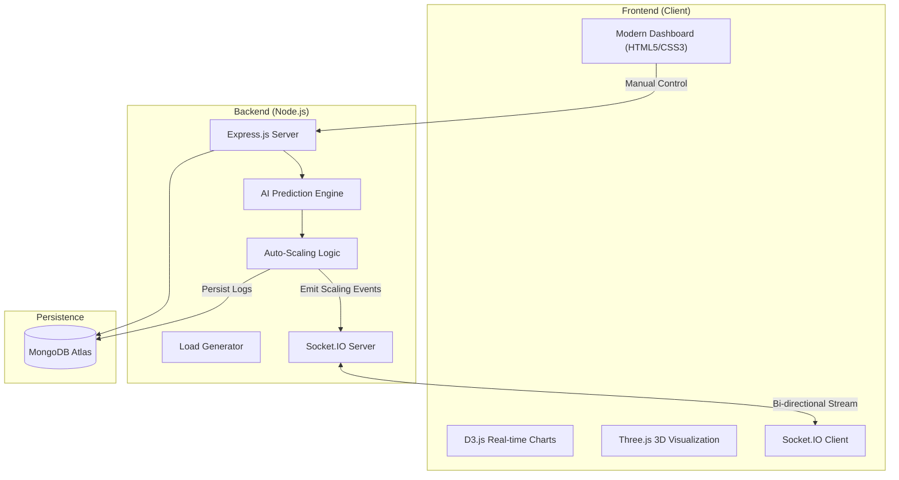

# 🚀 CloudPulse AI v2.0 — Smart Auto-Scaling Optimizer

[](https://github.com/)
[](https://opensource.org/licenses/MIT)
[](https://socket.io/)
[](https://github.com/)

**CloudPulse AI** is a high-fidelity, enterprise-grade cloud resource monitoring and auto-scaling simulator. It features a real-time AI-driven dashboard that monitors system telemetry (CPU, Memory, Network) and autonomously manages EC2 instance clusters to optimize performance and minimize cost.

---

## 💎 Core Architecture

CloudPulse AI uses a **Real-Time Event-Driven Architecture** to ensure sub-millisecond synchronization between the cloud simulation and the operator dashboard.



---

## ✨ Key Features

### 🧠 Smart AI Prediction Engine
Unlike basic threshold-based systems, CloudPulse AI incorporates a **Trend-Analysis Prediction Engine**. 
- **Forecasting**: Predicts next-cycle CPU load using linear regression and variance analysis.
- **Proactive Scaling**: Triggers "Prepare Scale Up" events when high-confidence spikes are detected before they hit thresholds.
- **Confidence Scoring**: Dynamic confidence calculation based on historical volatility.

### 📊 High-Fidelity Visualizations
- **3D Load Sphere**: A Three.js powered interactive orb that reacts to system load with dynamic colors and rotation speeds.
- **AI-Overlay Charts**: D3.js timeline charts that display live telemetry alongside AI-predicted trajectories.
- **Instance Grid**: Real-time visual representation of active vs. standby EC2 nodes.

### ⚡ Integrated Load Generation
- **Simulated Traffic**: Test your scaling policies by triggering Light, Medium, or "Heavy" computational spikes.
- **Bypass Cooldowns**: Manual "Force Scale" overrides for emergency operator intervention.
- **Real-time Logs**: Structured system logging with levels (INFO, WARN, ERROR, SUCCESS) persisted to MongoDB.

---

## 🛠️ Technology Stack

| Layer | Technologies |
| :--- | :--- |
| **Frontend** | Vanilla JS (ES6+), D3.js v7, Three.js, CSS Glassmorphism |
| **Backend** | Node.js, Express, Socket.IO v4, Morgan, Helmet |
| **Database** | MongoDB Atlas (Mongoose ODM) |
| **AI/ML** | Linear Regression & Variance Analysis Algorithms |
| **Real-time** | WebSocket (Bi-directional binary streaming) |

---

## 🚀 Getting Started

### 1. Prerequisites
- [Node.js](https://nodejs.org/) (v16+)
- [MongoDB Atlas](https://www.mongodb.com/cloud/atlas) account (or local MongoDB)

### 2. Environment Setup
Create a `.env` file in the root directory:
```env
PORT=3000
MONGO_URI=your_mongodb_connection_string
```

### 3. Installation
```bash
# Clone the repository
git clone https://github.com/your-username/cloudpulse-ai.git

# Install dependencies
npm install

# Start the development server
npm run dev
```

---

## ⚙️ Scaling Configuration

The system is pre-configured with the following enterprise defaults (tunable in `server.js` or via the Dashboard Settings):

- **Scale Up Threshold**: `> 70% CPU`
- **Scale Down Threshold**: `< 30% CPU`
- **Cooldown Period**: `10 Seconds`
- **Max Instances**: `5`
- **Min Instances**: `1`

---

## 📡 API Reference

### Real-Time (WebSockets)
| Event | Direction | Description |
| :--- | :--- | :--- |
| `systemMetrics` | Server -> Client | Full telemetry payload (CPU, Mem, Net, Costs) |
| `scalingUpdate` | Server -> Client | Notifies when a scaling event occurs |
| `manualScale` | Client -> Server | Request manual increment/decrement |
| `toggleAI` | Client -> Server | Enable/Disable the AI Prediction Engine |

### REST API
| Endpoint | Method | Description |
| :--- | :--- | :--- |
| `/api/load` | GET | Generate a CPU spike (params: `intensity`) |
| `/api/status` | GET | Current system snapshot |
| `/api/scaling/events`| GET | List last 30 scaling actions |
| `/api/logs` | GET | Retrieve historical system logs |

---

## 📄 License
Distributed under the MIT License. See `LICENSE` for more information.

---

<p align="center">
  Developed with ❤️ by <b>CloudPulse AI Team</b>
</p>
